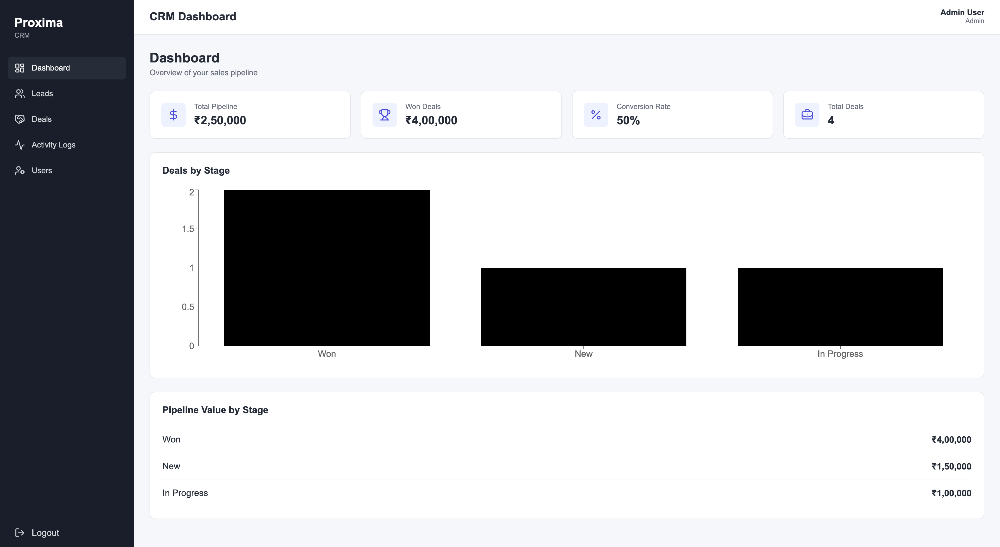

# CRM Dashboard

A full-stack Customer Relationship Management (CRM) application for managing leads, deals, users, and activity logs through a centralized dashboard.

### Demo Credentials

Admin - admin@proxima.com

Password - Password@123

## Features

* JWT-based authentication and authorization
* Role-based access control for Admins and Agents
* Lead management with search, filtering, pagination, and CRUD operations
* Deal management with lead relationships and pipeline stages
* User management and role updates
* Activity log tracking
* Dashboard statistics and overview
* Protected frontend routes
* RESTful backend APIs
* MongoDB-based data persistence

## Tech Stack

### Frontend

* React
* React Router
* Axios
* Lucide React
* CSS

### Backend

* NestJS
* TypeScript
* MongoDB
* Mongoose
* Passport.js
* JWT
* Class Validator

### Deployment

* Vercel
* Render
* MongoDB Atlas

## License

This project is for demonstration and portfolio purposes.
